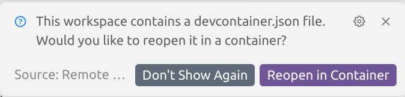
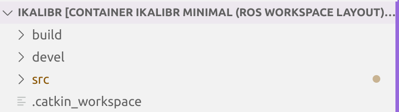

# iKalibr Setup Guide

## Prerequisites
- Git
- VS Code or Cursor (recommended)
- Docker
- Docker Compose

## Installation Steps

1. Clone the repository from our fork:
   ```bash
   git clone -b hmnd git@github.com:HumanoidTeam/iKalibr.git
   cd iKalibr
   ```

2. Open the project in VS Code/Cursor:
   - Launch your editor
   - File -> Open Folder -> Select the `iKalibr` directory

3. Set up Development Container:
   - When prompted, click "Reopen in Container" in the popup notification:
   
   - This will build and start the development container (may take a few minutes on first run)
   - Alternatively, you can:
     - Press F1 or Ctrl+Shift+P
     - Type "Reopen in Container"
     - Select "Remote-Containers: Reopen in Container"

4. Wait for the container to build and initialize. Once complete, you'll have a fully configured development environment with all dependencies installed.

## Building iKalibr

1. Once the devcontainer is set up, you should see a ROS1 catkin workspace layout in the explorer:
   
   
   The workspace contains:
   - `build/`: Build artifacts and CMake files
   - `devel/`: Development space with setup files and libraries
   - `src/`: Source code directory
   - `.catkin_workspace`: Catkin workspace marker file

2. Build the project:
   ```bash
   # Build iKalibr
   cd src/ikalibr && ./build_ikalibr.sh
   ```
3. 

## Running iKalibr

## Troubleshooting

If you don't see the "Reopen in Container" prompt:
1. Ensure Docker is running on your system
2. Command Palette (F1) -> "Remote-Containers: Rebuild and Reopen in Container"
3. Check the .devcontainer/devcontainer.json file exists and is valid

## Next Steps

- Review the project documentation in the `docs/` directory
- Check out the example configurations in `config/`
- Start with the calibration examples in `data/`

For more information about development containers, see the [official VS Code documentation](https://code.visualstudio.com/docs/devcontainers/containers). 

